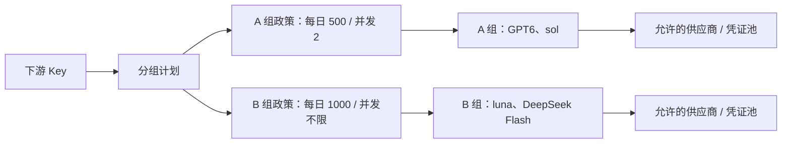

# CPA 分组计费插件 · V1 设计规格

设计日期：2026-09-17。用户已接受推荐首版方向。
基线：`cpa-plugin-key-billing v1.3.11 / 0014bc58`。
状态：设计定稿；规格、接口契约和数据结构可供开发，尚无生产功能实现。

## 1. 已确定的产品规则

| 项目 | V1 决定 |
| --- | --- |
| 计费主体 | 一个下游 CPA API Key 一个主体；相同备注不合并 |
| 日额度 | Asia/Shanghai 自然日，00:00 切换 |
| 分组方式 | 按明确的逻辑模型 ID/别名唯一归组，然后限定凭证池 |
| 独立维度 | 每 Key × 每组独立累计金额、Token、请求数和实时并发 |
| A/B 示例 | A：GPT6 + sol，每日 $500、并发 2；B：luna + DeepSeek Flash，每日 $1000、并发不限 |
| B 组不限金额 | 管理员在套餐中切换为不限，不修改组定义 |
| 金额计算 | 沿用现有模型定价及用量语义，汇总插件计算的 USD |
| 不限 | 新接口金额、并发字段用 null；禁用用 enabled=false |
| 超额度 | 达到额度后拒绝新请求，已放行请求正常结算 |
| 未归组 | 使用分组计划时拒绝，返回可定位的错误 |
| 组间借用 | 不自动借用其他组余额，不因无凭证或额度不足切到其他组 |
| 备注共享 | Keeper 保存下游 Key 备注及上游身份别名；计费插件通过 API 读写 |
| 备注刷新 | 打开相关页面、手动刷新、写入后回读；不承诺两边页面实时推送 |
| 持久化 | 计费与 Keeper 各自维护数据库 |
| 部署 | 首版按单个 CPA 进程设计；多个副本不共享额度/并发 |

### 可配置性（不是固定 A/B 或固定模型）

系统不内置 GPT、DeepSeek 等特定模型，也不内置 A/B 组。首次安装的分组列表为空，原有 Key 保持旧模式；示例数据仅用于设计预览，不自动写入生产配置。

管理员可以创建任意业务名称、任意数量的资源组，在 CPA 实际模型目录中搜索并多选模型，也可精确录入宿主已提供的模型别名。供应商和凭证选项来自 CPA 当前配置，不使用写死的供应商名单。
例如可建立“高能力”“日常”“代码”“备用”等组，但这些名称没有特殊含义。组内模型数量、组数量和套餐内政策行数均动态生成，不存在固定的 A/B 字段或 GPT 专用判断。

套餐通过 group_id 引用组，每个套餐对每组分别配置额度、并发和访问开关。新建组不会自动开放给已有套餐，管理员显式添加政策后才允许访问；不填政策等于无权限，不等于不限。
改组名不改变模型归属、账本和套餐绑定；发布后的模型成员变更仍遵循下文的安全迁移规则。

模型名均为用户示例。预览中用展示名称，正式配置必须从 CPA 的模型目录选取确切 ID，验证 alias 是否在 usage 中保留。
不预置或猜测上述模型的真实价格。

## 2. 首版范围

包含：资源组管理、组凭证池、套餐的组日限额及并发、Key 绑定、分组使用情况、Keeper 共享备注、分组事件查询、配置命中预览、修改记录。

预留但首版不实现：多人/多 Key 合并、月限额、单用户加额覆盖、充值支付、严格预扣、外部通知、全站组并发上限、订阅到期时间、跨实例配额、SQL 直写 Keeper。
原有全局套餐功能保持原行为；分组计划启用后，旧额度和旧 Key 并发不隐式叠加，避免 B 标为不限却被旧设置阻断。
迁移预览必须显示将被替换的旧约束。用户原有模型/凭证路由权限继续生效。

## 3. 概念与关系

资源组只定义资源；计划定义使用政策；Key 绑定计划。

共享 A 组定义的两个套餐可以分别设置 $500 与 $1000。修改套餐金额不会修改模型归属。
不同 Key 的账本独立。无限额度组仍记账，无限并发组仍统计在途数。

组字段：ID、名称、展示说明、启用状态、模型列表、允许/排除凭证指纹、允许/排除凭证类别、修订号。
首版只支持精确模型匹配，不支持通配符；同一模型不能同时属于两个已发布组。
组 ID、模型成员在正式发布后冻结；名字、说明可以修改。需要改模型归属时采用明确的维护迁移，不提供在线强制挪组按钮。
新增模型/组通过草稿验证和发布；新模型尚未发布前不被分组计划放行。

凭证池允许整类选择与单个排除。source 为 `auth-files` 或 `ai-providers`；具体供应商实例用指纹区分。
空白名单表示在 Key 原有权限内不进一步缩小；勾选“固定凭证列表”后必须至少选择一项，不能意外把空列表当作全部。
最终候选为 CPA 当前可用候选、Key 原有权限、组凭证池三者交集，黑名单始终优先。
整类选择会包含将来新增的同类凭证，固定指纹列表不会；界面显示这一区别。
无法确定凭证来源而又有来源限制时拒绝该候选，不猜测供应商身份。

## 4. 额度、并发和账本

默认 A/B 每组一个自然日窗口，支持各组 enabled、daily_limit_usd、concurrency_limit。
金额及并发为 null 时不限；金额为正十进制字符串，并发为 1–10000 的整数；零和负数不表示不限。
日期由服务端时区计算，客户端时钟仅影响显示。

账本键为 `(scope, group_id, business_date)`，套餐切换不改变当天这本账，避免换套餐领取两次额度。
首次加入分组套餐默认次日生效；原有 Key 当天仍按旧模式处理。首次安装也可通过无历史流量的新 Key 演示上线，但须明确转换边界。
已有分组 Key 更换套餐默认次日 00:00 生效。调整当前套餐额度/并发立即生效且保留已用量；在途请求继续运行，降低并发只阻止新准入。
撤销组访问立即拒绝新请求，已经使用的记录保留。

费用取自 usage.handle 中的可靠用量，沿用模型价格、缓存和 reasoning 计算；此版本不改变上游计价算法。
分组账本将最终费用舍入到 10^-9 USD，保存整数 nano-USD；单次费用总和只舍入一次。
API 金额用十进制字符串输出；旧接口和旧请求事件原有金额字段保持兼容。
整数转换遇到负数、NaN、Infinity 或溢出必须失败并记录错误，不能环绕为较小余额。

跨午夜的请求使用 CPA `UsageRecord.RequestedAt` 确定日期，即便新日已建立账本，也仍累计旧日记录。
账本不因跨日物理清零；“重置”通过另存抵扣基线实现，保留原始消费。
手动重置使用界面要求的理由，并写入 reset 截止时间；开始时间早于 reset 的迟到 usage 记原始费用，但不扣 reset 后的有效额度。
同一组金额使用量为原始消费减去最近 reset 前消费，包括 reset 前开始且后来上报的费用。

新请求在单个锁/事务边界内检查当前组额度、申请 `(scope, group_id)` 并发槽；失败不占槽。
槽位由 `(RequestID, scope, group_id)` 关联。未知 complete 无操作；重复 complete 不重复释放。
HTTP 失败、客户端取消、流式结束都释放；旧进程退出后没有在途请求，所以重启后并发归零，金额不清零。

没有严格费用预扣：余额 $1 时仍可放行最终花费 $5 的请求。UI 可显示原始超额数额，剩余额度展示为 0。
金额未知、usage 缺失或计价不完整时保存事件并标记 `unpriced/unclassified`，显示“金额可能低估”，不编造 0 成本等同无消费。
关键账本写入失败后，受影响分组准入进入降级拒绝状态，直到存储恢复且待处理记录处理成功；不能显示保存成功。
存储不可写期间的内存待处理记录不能保证在崩溃后恢复，宿主也未确认会重放 usage；这种情况下须人工对账，不能承诺自动补齐。不得为了掩盖缺口启动后台刷盘或猜测请求关联。
现有 CPA 未提供跨重试的可靠 usage 幂等 ID，不承诺网络级 exactly-once，不以模型+时间拼接去重。

## 5. 请求归组与宿主契约

准入取 RequestedModel，结算取 UsageRecord.Alias 优先、Model 兜底；两端使用同一发布后的精确映射表。
仅有上游 Model 且可对应多个别名组时不能猜测，记录 `unclassified` 并标记该配置不满足上线条件。
配置预览区分“静态匹配通过”与“目标 CPA 协议联调通过”，后者不是一次目录检查能证明的。

当前 CPA usage 没有与拦截器相同的 RequestID。V1 利用不可变的模型→组映射归组，不从在途列表猜测 usage。
RequestedAt 只用于账期和生效边界，不用于猜测并发请求关联。
新组发布、Key 模式转换以及主进程重启前后的边界需端到端验证；发布时间之前开始的事件保留为 legacy/unclassified，不能用新规则追溯归类。
内部插件 helper 仍按其实际报告的模型归组记账，但不占第二个外部客户端准入槽；helper 是否受组权限约束与宿主跳过机制一起联调，未确认的组合不可宣传为严格隔离。
所有功能仅使用现有 CPA 能力，不要求修改 CPA。

## 6. Keeper 集成

下游共享字段为 `cpa_api_keys.key_alias`；上游共享字段为 `usage_identities.alias`。
上游 `note` 是 CPA 原始备注，仅作为单独的只读字段展示；不给用户造成改 alias 等于改 CPA note 的错觉。

读写操作：

| 对象 | 读取 | 写入 |
| --- | --- | --- |
| 下游 Key | `/api/v1/usage/api-keys/settings` 建立映射；普通列表更新显示 | PATCH `/api/v1/usage/api-keys/:id`，keyAlias |
| 上游身份 | `/api/v1/usage/identities` | PATCH `/api/v1/usage/identities/:id`，alias |

Keeper base URL 允许带部署子路径，API 路径在其后拼接。
认证使用 Keeper 管理员登录及 CookieJar。密码从配置指定的环境变量读取，session 只保存在内存。
后台不启动刷新线程；管理调用按需登录/验证，在 401 后仅尝试一次重新认证。403 不盲目重试。
设置超时并拒绝带 Cookie 的跨源重定向；日志与错误过滤认证信息。
所有写入包含 `X-CPA-Usage-Keeper-Request: fetch`，不把 CPA 管理密钥发送给 Keeper。

下游映射以 caller scope 为准：在插件后端接收到 Keeper settings 的 apiKey 后瞬时哈希，立即丢弃原文；UI 不收到原文。
同一 Keeper 实例内 `(auth_type, identity)` 关联上游；不以邮件、备注、脱敏预览或数据库行号跨实例匹配。
缓存记录源实例 ID、外部对象 ID、scope/identity、值和读取时间；更换 Keeper URL 创建新实例 ID，旧映射失效。
修改前重新读取并验证对象匹配；删除/重新创建的 Key 不凭旧 id 覆写其他对象。

两个页面写同一份数据，刷新后可见。插件修改成功后回读；Keeper 最终确认后才显示已保存。
Keeper 没有确认支持跨客户端 CAS：检测到读值已变时显示冲突，但无法保证另一个页面并发写入绝不覆盖；实际采用最后成功写入值。
读取失败展示最后成功值与“未更新”提示；写入失败不落到另一份独立备注。状态不影响模型请求的计费和并发。
空备注是合法值，不能回退显示旧 alias。初次接入默认 Keeper 优先，已有本地备注保留作为可查看的迁移前值。

V1 不直接连接 Keeper SQL。API 是唯一正式适配器，后续如需要同机 SQL 只读可在同一接口后增加实现。

## 7. 页面与操作流程

保留原插件外壳和管理/自助两种权限视图。新增入口不让普通 Key 用户看管理设置。

1. 资源组：列表→新建草稿→选择模型和凭证池→查看未归组/冲突→发布。已发布模型成员只读，改名不影响归组。
2. 分组套餐：输入名称，每行一组，设置日金额、无限开关、并发、可用开关。保存时显示影响的 Key 数量。
3. Key 详情：Keeper 备注、脱敏 Key、套餐、各组今日消费/剩余/重置时间/当前并发。修改备注可见保存来源。
4. 使用记录：按组、Key、日期筛选，显示用户模型、上游模型、费用、是否失败。旧历史单列“未分组历史”。
5. Keeper 设置：URL、密码环境变量名称、测试连接、对象匹配数量、读取时间和错误状态；无密码明文字段。
6. 修改记录：对象、字段、前后值、时间、理由、结果；管理身份仅标记为宿主提供的可信身份或 management-key，不伪造具体操作者姓名。

自助页先显示 A/B 组的剩余额度和当前并发，支持按组看自己的请求；上游内部备注默认不对普通用户返回。
不限额度显示“今日已用 $X · 不限额”，不画虚假的 0% 消费进度条。
组额度耗尽和并发已满分别显示原因与恢复方式；不使用同一句“余额不足”。
所有列表及弹窗支持键盘与 320px 窄屏，金额和按钮不截断。

## 8. 接口与数据文件

- [接口契约](openapi.json)：OpenAPI 3.1，新增接口放在原插件前缀下的 `/v1/`，未实装。
- [数据结构参考](schema.sql)：只描述新增表，不是可直接用于生产的完整迁移。
- [验收清单](acceptance.md)：实现完成的判断标准。

沿用现有 PluginID，二开版替换原版，避免加载两份拦截器。首版不与原版同时加载。
新增分组计划采用独立结构，原 plans 表及旧 API 保留。
真实迁移候选为 schema v14→v15，以实现时基线为准；旧请求不倒推归组，所有旧数据保留。

新 API 使用显式修订号防止两个计费管理页面互相覆盖；不会因此声称 Keeper 也支持同样的 CAS。
HTTP 账本错误与准入拒绝码需与 OpenAPI 一致。API 返回外部字符串均按普通文本展示，不能 innerHTML 插入备注。
组定义、套餐、Key 绑定和修改审计必须同事务提交。
Keeper 远端写入不可能与本地 SQLite 同事务；记录写入意图及结果。远端超时可能已写成功，使用 outcome_unknown 状态并回读确认，不能无脑重试或假报失败。

## 9. 开发顺序

1. 纯 Go 组匹配和策略领域逻辑；单测覆盖互斥规则、原有路由交集。
2. SQLite 迁移、历史日账本、reset 基线、金额精度、配置修订与审计。
3. RPC 准入、调度、usage 和 complete 接线；验证别名一致性及迟到 usage。
4. Keeper API 适配器；以 dummy 服务测试会话、读写、超时和映射。
5. 管理/自助页面和原有事件查询扩展。
6. 迁移副本与端到端测试，完成后才构建分发动态库。

本次设计不会连接真实 Keeper，不创建生产数据库，不执行任何收费请求，不发布版本。
